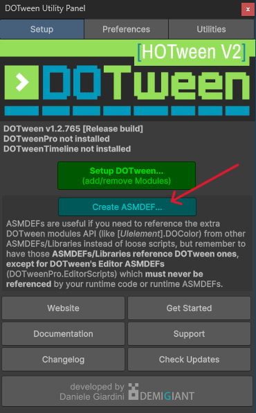

# Tweening Components

Powered by **DOTween**. **Tweening Components** is a package that provides a set of preset components to animate UGUI in Unity using scriptable objects.

## Installation

> [!IMPORTANT]  
> **In your Unity project, install [DOTween](https://assetstore.unity.com/packages/tools/animation/dotween-hotween-v2-27676).**

### Set Up DOTween

> [!IMPORTANT]  
> **Create an Assembly Definition for DOTween.**



### Installing Tweening Components

`Package Manager >> Add (plus symbol, top-left) >> "Install package from git URL..."`

```console
https://github.com/Tirtstan/Tweening-Components.git
```

Done!
