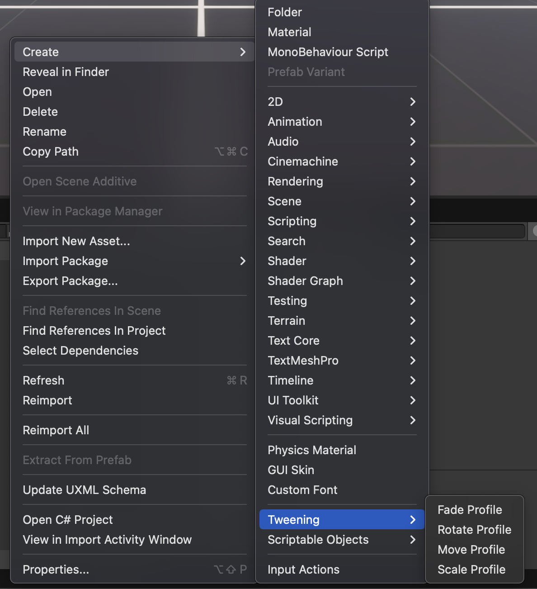
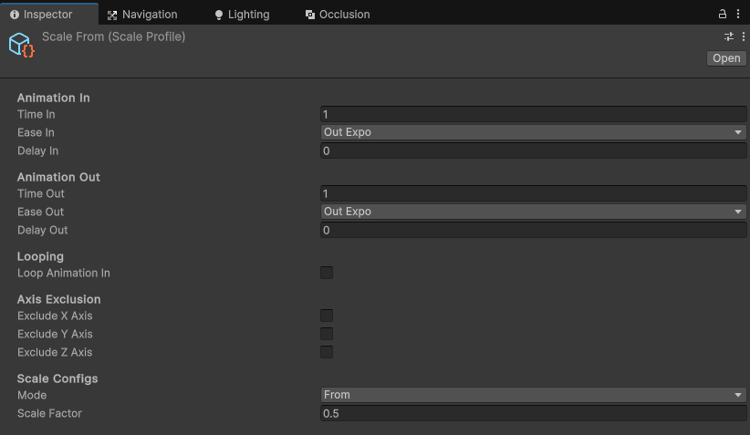

# Tweening Components

Powered by **DOTween**. **Tweening Components** is a package that provides a set of preset scriptable objects to animate UGUI in Unity.

## Installation

```console
https://github.com/Tirtstan/Tweening-Components.git
```

### Dependencies

-   TextMeshPro
-   DOTween

### 1. Set Up DOTween

**In your Unity project, install [DOTween](https://assetstore.unity.com/packages/tools/animation/dotween-hotween-v2-27676).**

> [!IMPORTANT]  
> **Create an Assembly Definition for DOTween.**


### 2. Installing Tweening Components

In the Package Manager, `Click the Plus Button > Install the package from a git URL...` and paste the following in:

```console
https://github.com/Tirtstan/Tweening-Components.git
```


## Usage

### 1. Add a `TweenOnEvent` component to you desired object:


### 2. Create a `TweenProfile`:

In your Project tab, `Right Click > Create > Tweening`.



### 3. Edit the `TweenProfile` to your desired liking:



### 4. Edit the `TweenOnEvent` component with all references and desired configurations:


**Done!**

## Samples

Don't forget to check out the `Samples` folder for more extensive examples!
