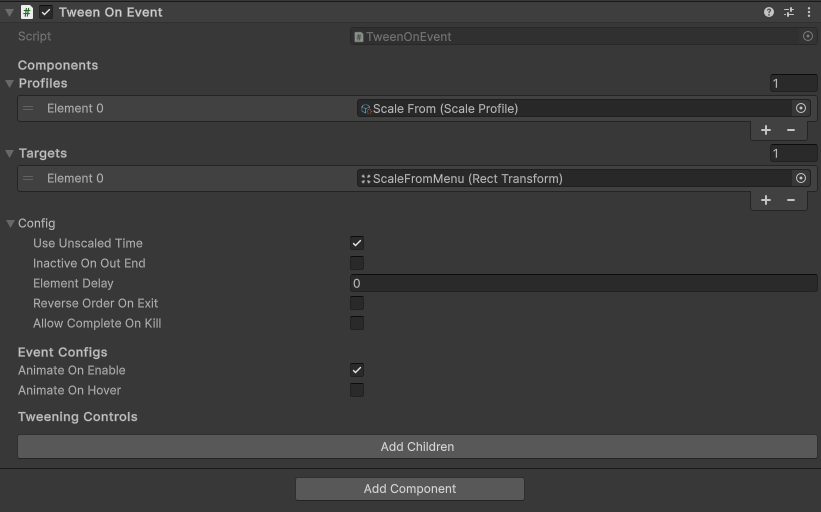

# Tweening Components

Powered by **DOTween**. **Tweening Components** is a package that provides a set of preset components to animate UGUI in Unity with scriptable objects.

## Installation

### Dependencies

-   TextMeshPro
-   DOTween

### Set Up DOTween

**In your Unity project, install [DOTween](https://assetstore.unity.com/packages/tools/animation/dotween-hotween-v2-27676).**

> [!IMPORTANT]  
> **Create an Assembly Definition for DOTween.**


### Installing Tweening Components

Install the package from a git URL...

```console
https://github.com/Tirtstan/Tweening-Components.git
```


## Usage

1. Add a TweenOnEvent component to you desired object:


2. Create a Tween profile:


3. Edit the Tween profile to your desired liking:


4. Edit the TweenOnEvent component with all references and desired configurations:



**Done!**

## Note

Certain fields on the profiles like target and factor will not affect the tween depending on the chosen mode.
